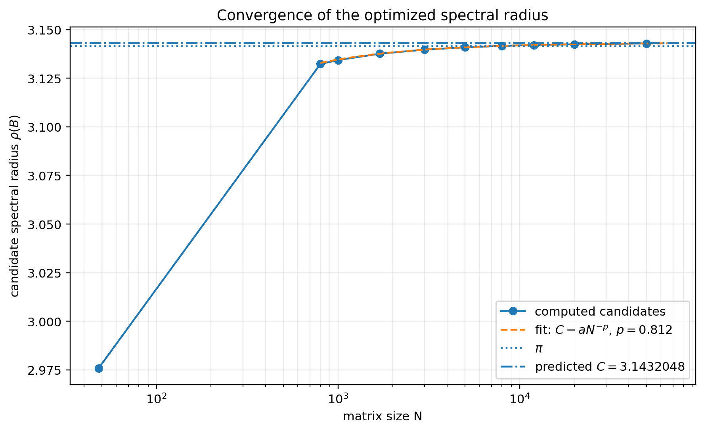

# Large-dimensional plateau-profile investigation

This directory studies candidate extremal configurations at sparse matrix sizes
up to $N=50000$. Unlike the unrestricted search in
[`../small_dimension/`](../small_dimension/), the large-dimensional computation
uses a compressed symmetric plateau model.

Produced by ChatGPT for the purpose of numerical exploration. Not independently audited at this time.

## Scope and normalization

For positive consecutive gaps $g_j=\lambda_{j+1}-\lambda_j$, define

$$
\delta_1=g_1,
\qquad
\delta_N=g_{N-1},
\qquad
\delta_k=\min(g_{k-1},g_k)
\quad (2\le k\le N-1),
$$

and

$$
B_{mn}=
\frac{\sqrt{\delta_m\delta_n}}{\lambda_m-\lambda_n}
\quad (m\ne n),
\qquad B_{mm}=0.
$$

The objective is the largest eigenvalue of the Hermitian matrix $iB$, which is
the spectral radius of $B$.

All profiles use the minimum-gap normalization

$$
\gamma_0=1.
$$

The sampled matrix sizes are

$$
N=48,800,1000,1700,3000,5000,8000,12000,20000,50000.
$$

The largest profile with locally refined integer plateau counts is $N=20000$.
The $N=50000$ profile is an optimized and directly validated admissible
candidate, but its plateau counts were initialized from a $\pi$-geometric
profile and were not exhaustively refined.

## Structural assumptions

The large-$N$ search assumes:

1. reversal symmetry of the gap list;
2. a contiguous piecewise-constant profile of the form

   $$
   \gamma_L^{[n_L]},\ldots,\gamma_1^{[n_1]},1^{[n_0]},
   \gamma_1^{[n_1]},\ldots,\gamma_L^{[n_L]};
   $$

3. strictly increasing levels
   $1=\gamma_0<\gamma_1<\cdots<\gamma_L$.

The inequalities $n_{j+1}\le n_j$ were not imposed in the principal runs; they
held for all reported candidates. The conjectural asymptotic count formulas
were used for some starting profiles, but not as hard constraints.

The large-dimensional results therefore do not independently test symmetry or
the plateau ansatz. The unrestricted computations through $N=48$ are the
independent numerical evidence for those features.

## Numerical method

A dense matrix requires $O(N^2)$ storage. The search instead applies the Cauchy
kernel $1/(x-y)$ with a one-dimensional hierarchical block method:

- near blocks are evaluated directly;
- well-separated target/source blocks use source-centered Taylor expansions;
- reverse blocks are defined as negative transposes, preserving skew-symmetry
  in floating point.

The resulting matrix-vector product is approximately $O(pN\log N)$, where $p$
is the expansion rank. A warm-start Lanczos iteration estimates the top
eigenpair. Gap levels are polished using finite differences of the Rayleigh
quotient, while plateau counts are refined by discrete transfers across
adjacent boundaries.

This remains a nonconvex local search inside the assumed profile class. It does
not prove global optimality.

## Numerical validation

Two complementary checks are supplied.

1. [`search_plateau_profiles.py`](search_plateau_profiles.py) can reevaluate a
   profile and vector with several stricter hierarchical settings, bound the
   Taylor truncation contribution, and optionally perform a direct $O(N^2)$
   matrix-vector product.
2. [`validate_rayleigh_witness.py`](validate_rayleigh_witness.py) is independent
   of the hierarchical search code. It evaluates the Rayleigh quotient by
   summing all $N(N-1)/2$ unordered pairs directly.

These are floating-point checks, not interval-arithmetic proofs. The direct
pairwise margins above $\pi$ are nevertheless many orders of magnitude larger
than the observed cross-method discrepancies.

## Main numerical results

Counts are listed from the central plateau outwards:
$[n_0,n_1,\ldots,n_L]$.

| $N$ | Candidate $\rho(B)$ | $\rho(B)-\pi$ | $L$ | $n_0/N$ | Counts | Count status |
|---:|---:|---:|---:|---:|---|---|
| 48 | 2.975825380668484 | -0.165767273 | 2 | 0.854167 | `[41, 2, 1]` | unrestricted small-$N$ search |
| 800 | 3.132299222002076 | -0.009293432 | 5 | 0.801250 | `[641, 54, 16, 6, 2, 1]` | locally count-refined |
| 1000 | 3.134307741092329 | -0.007284912 | 5 | 0.799000 | `[799, 69, 20, 7, 3, 1]` | locally count-refined |
| 1700 | 3.137588669078718 | -0.004003985 | 6 | 0.791176 | `[1345, 125, 34, 11, 4, 2, 1]` | locally count-refined |
| 3000 | 3.139666212413383 | -0.001926441 | 6 | 0.747000 | `[2241, 274, 71, 22, 8, 3, 1]` | locally count-refined |
| 5000 | 3.140865817027155 | -0.000726837 | 7 | 0.688600 | `[3443, 575, 141, 41, 14, 5, 1, 1]` | locally count-refined |
| 8000 | 3.141609331452917 | +0.000016678 | 7 | 0.655125 | `[5241, 983, 274, 81, 27, 10, 3, 1]` | locally count-refined and directly validated |
| 12000 | 3.142054933607138 | +0.000462280 | 7 | 0.681917 | `[8183, 1302, 414, 132, 42, 13, 4, 1]` | $\pi$-geometric count seed; levels optimized |
| 20000 | 3.142448640354002 | +0.000855987 | 8 | 0.681550 | `[13631, 2122, 739, 221, 69, 22, 7, 3, 1]` | locally count-refined |
| 50000 | 3.142844355775985 | +0.001251702 | 9 | 0.681580 | `[34079, 5425, 1727, 550, 175, 56, 18, 6, 2, 1]` | $\pi$-geometric count seed; levels optimized and directly validated |

Complete levels, residuals, search-status metadata, and fitted quantities are
stored in [`results/`](results/).

## Assessment of the conjectures

### 1. Reflection symmetry

Symmetry was imposed at large $N$, so these runs do not independently test the
first conjecture. The unrestricted calculations through $N=48$ remain the
relevant evidence.

### 2. Plateau structure and decreasing counts

The symmetric contiguous plateau form and increasing levels were imposed. The
count inequalities $n_{j+1}\le n_j$ were not imposed and held for every
reported candidate. Thus the count-monotonicity portion receives conditional
support, while the plateau form itself is not independently tested here.

### 3. Number of levels

The data support

$$
L_N=\log_{\pi}N+O(1).
$$

The observed offsets $L_N-\log_{\pi}N$ remain bounded, approximately between
$-1.21$ and $-0.44$ for the large-$N$ records. A sharper empirical rule is

$$
L_N\approx
\operatorname{nint}\!\left(\log_{\pi}\left(\frac12
\left(1-\frac1\pi\right)N\right)\right),
$$

which matches every sampled value. This should still be viewed as a finite-data
heuristic.

### 4. Gap-level growth

The data support

$$
\gamma_j=N^{j+o(1)}
\qquad\text{for fixed }j.
$$

For the five largest sizes, $\gamma_1/N$ is approximately stable, whereas
$\gamma_1/\sqrt N$ grows rapidly. Selected scaled values are:

| $N$ | $\gamma_1/N$ | $\gamma_2/N^2$ | $\gamma_3/N^3$ |
|---:|---:|---:|---:|
| 5000 | 0.0423233 | $2.88393\times10^{-4}$ | $7.06017\times10^{-7}$ |
| 8000 | 0.0442441 | $4.32170\times10^{-4}$ | $8.46057\times10^{-7}$ |
| 12000 | 0.0470703 | $5.02718\times10^{-4}$ | $8.42278\times10^{-7}$ |
| 20000 | 0.0462593 | $6.23176\times10^{-4}$ | $8.66302\times10^{-7}$ |
| 50000 | 0.0461465 | $6.37642\times10^{-4}$ | $7.32535\times10^{-7}$ |

Log-log slopes fitted over $N\ge5000$ are approximately

$$
1.034,\ 2.328,\ 3.002,\ 3.667,\ 4.237,\ 4.913
$$

for $j=1,\ldots,6$. Deeper layers are more affected by finite-size and
terminal-layer effects.

### 5. Central plateau count

The conjectured constant is

$$
1-\frac1\pi=0.681690113816\ldots.
$$

At $N=20000$, the largest independently count-refined run gives

$$
\frac{n_0}{N}=0.68155.
$$

At $N=8000$, the locally preferred count list has $n_0/N=0.655125$, but a
near-conjectural count list gives a Rayleigh quotient only
$5.78\times10^{-6}$ smaller. The integer-count landscape is therefore very
flat. The conjecture is plausible, but the current computations do not identify
the count constant as decisively as they identify the gap exponent or the
existence of finite witnesses above $\pi$.

### 6. Noncentral plateau counts

At $N=20000$, the observed fractions agree well with

$$
\frac12\left(1-\frac1\pi\right)\pi^{-j}.
$$

| $j$ | Observed fraction / proposed fraction |
|---:|---:|
| 1 | 0.97793 |
| 2 | 1.06993 |
| 3 | 1.00521 |
| 4 | 0.98597 |
| 5 | 0.98761 |
| 6 | 0.98721 |

Outer layers with counts of only a few integers fluctuate substantially. The
$N=12000$ and $N=50000$ count lists are not independent tests because they
began from $\pi$-geometric seeds.

## Prediction for the limiting spectral radius

A nonlinear least-squares fit on $N\ge1700$ to

$$
\rho_N=C-aN^{-p}
$$

gives

$$
C=3.1432048339,
\qquad
a=2.36378,
\qquad
p=0.81233,
$$

with an RMS residual of approximately $1.28\times10^{-6}$. Varying the lower
cutoff gives fitted limits near $3.143204$--$3.143208$.

The resulting numerical prediction is

$$
\boxed{\lim_{N\to\infty}\sup_\lambda\rho(B(\lambda))\approx3.143205,}
$$

with a deliberately wider working interval

$$
3.14315\ \text{to}\ 3.14330.
$$

This is not a statistical confidence interval. It allows for model choice,
finite-size behavior, the structural profile assumption, and incomplete global
optimization of the integer counts.

Most importantly, the assertion that the optimal universal constant exceeds
$\pi$ does not rest only on extrapolation: the stored $N=8000$ and $N=50000$
Rayleigh witnesses already exceed $\pi$ numerically.



## Reproduction

Install the root requirements first:

```bash
python -m pip install -r requirements.txt
```

### Reevaluate the stored $N=8000$ witness

From the repository root:

```bash
python large_dimension/validate_rayleigh_witness.py --N 8000 --extended-terms
```

The default result table and vector paths are resolved relative to the script,
so this command works from the repository root or from another working
directory.

### Cross-check a profile with the hierarchical code

```bash
python large_dimension/search_plateau_profiles.py validate \
  --profile large_dimension/witnesses/profile_N8000.json \
  --vector large_dimension/witnesses/eigenvector_N8000.npy \
  --direct \
  --out outputs/validation_N8000.json
```

### Refine a profile locally

```bash
python large_dimension/search_plateau_profiles.py search \
  --profile large_dimension/witnesses/profile_N8000.json \
  --vector large_dimension/witnesses/eigenvector_N8000.npy \
  --level-iterations 4 \
  --count-cycles 1 \
  --out outputs/refined_N8000.json \
  --vector-out outputs/refined_vector_N8000.npy
```

### Generate and select starting profiles

```bash
python large_dimension/search_plateau_profiles.py seeds \
  --N 8000 --L 8 \
  --out outputs/seeds_N8000.json

python large_dimension/search_plateau_profiles.py search \
  --profile outputs/seeds_N8000.json \
  --profile-index 0 \
  --out outputs/refined_seed_0.json
```

### Regenerate figures and the fit table

```bash
python large_dimension/analyze_results.py
```

The $N=50000$ direct all-pairs validation is an $O(N^2)$ computation and can
take appreciably longer than the $N=8000$ check.

## Files

### Programs

- [`search_plateau_profiles.py`](search_plateau_profiles.py): matrix-free search,
  profile refinement, and hierarchical validation.
- [`validate_rayleigh_witness.py`](validate_rayleigh_witness.py): independent
  direct all-pairs Rayleigh-quotient checker.
- [`analyze_results.py`](analyze_results.py): fit and figure generator.

### Results

- [`results/large_N_gap_search_results.json`](results/large_N_gap_search_results.json)
  and `.csv`: principal candidate table and metadata.
- [`results/large_N_gap_layers.csv`](results/large_N_gap_layers.csv): one row per
  $(N,j)$, including count fractions and gap scalings.
- `results/limit_fit_models.*`, `results/limit_fit_sensitivity.*`, and
  `results/limit_fit_recomputed.csv`: extrapolation tables.
- [`results/count_branch_comparison_N8000.json`](results/count_branch_comparison_N8000.json):
  comparison illustrating the flat integer-count landscape.

### Witnesses and validations

- [`witnesses/`](witnesses/): compact profile JSON files and matching eigenvector
  arrays for $N=8000$, $N=50000$, and an alternative $N=8000$ count branch.
- [`validation/`](validation/): direct pairwise checks, hierarchical checks, and
  cross-method summaries.

### Figures

- [`figures/`](figures/): standalone PNG figures used in this report and the
  root README.
